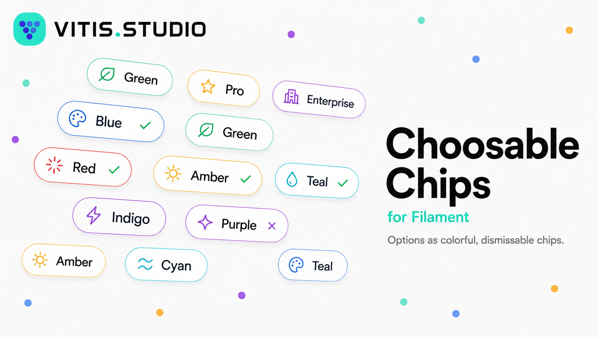
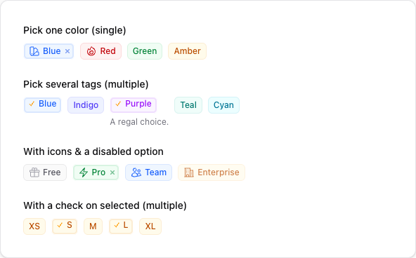
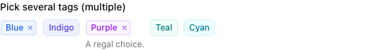
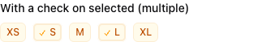
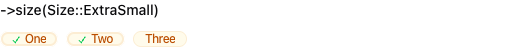
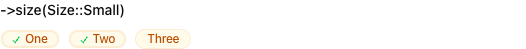
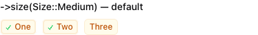

# Choosable Chips for Filament



[](https://packagist.org/packages/vitisstudio/filament-choosable-chips)
[](https://github.com/vitisstudio/filament-choosable-chips/actions/workflows/run-tests.yml)
[](https://packagist.org/packages/vitisstudio/filament-choosable-chips)
[](LICENSE.md)

A FilamentPHP v5 form field that renders checkbox/radio options as dismissable, colorable, icon-bearing badge **chips**. The API is patterned after `Select`/`ToggleButtons`, so per-option labels, colors, and icons are supplied through the same fluent option map you already know. Each chip is a native Filament badge, so it inherits Filament's theme out of the box.



## Features

- **Single or multi select** from one field — radio semantics by default, checkbox semantics with `->multiple()`.
- **Per-option color, icon, and description**, keyed by option value (same shape as `Select::options()`).
- **Dismissable chips** using the badge's built-in delete button — click a chip to toggle it, or click the × to clear it.
- **Selected check marks** with `->checkSelected()`, colored independently of the chip.
- Reuses the Filament **badge** component and color tokens, so it matches your panel with no extra CSS.
- Enum support and an `in` validation rule derived from the enabled options, like the built-in option fields.

## Requirements

- PHP 8.4+
- Filament v5 (`filament/forms` ^5.0)

## Installation

Install the package via Composer:

```bash
composer require vitisstudio/filament-choosable-chips
```

That's all that's required — the field uses Filament's existing badge styles, so there is nothing to publish or build for the default look.

If you use a [custom panel theme](https://filamentphp.com/docs/styling/overview#creating-a-custom-theme), register the package views as a Tailwind source in your theme's CSS so the chip utility classes are compiled:

```css
@source '../../../../vendor/vitisstudio/filament-choosable-chips/resources/views';
```

Then rebuild your theme (`npm run build`).

## Usage

Use the field anywhere you build a Filament schema (a resource form, a custom page, a relation manager, an action, etc.). Single-select (radio semantics) is the default — the field stores a single scalar value:

```php
use VitisStudio\FilamentChoosableChips\Forms\Components\ChoosableChips;

ChoosableChips::make('color')
    ->options([
        'blue' => 'Blue',
        'red' => 'Red',
        'green' => 'Green',
        'amber' => 'Amber',
    ])
    ->colors([
        'blue' => 'info',
        'red' => 'danger',
        'green' => 'success',
        'amber' => 'warning',
    ])
    ->icons([
        'blue' => \Filament\Support\Icons\Heroicon::OutlinedSwatch,
        'red' => \Filament\Support\Icons\Heroicon::OutlinedFire,
    ]);
```


### Multiple selection

Call `->multiple()` for checkbox semantics. The field then stores an **array** of values (cast the underlying Eloquent attribute as `array`):

```php
ChoosableChips::make('tags')
    ->multiple()
    ->options([
        'blue' => 'Blue',
        'indigo' => 'Indigo',
        'purple' => 'Purple',
        'teal' => 'Teal',
        'cyan' => 'Cyan',
    ])
    ->colors([
        'blue' => 'info',
        'purple' => 'purple',
    ])
    ->descriptions([
        'purple' => 'A regal choice.',
    ]);
```



### Icons and disabled options

Per-option icons accept a `Heroicon` enum case or an icon name. Disable individual options with `->disableOptionWhen()`:

```php
use Filament\Support\Icons\Heroicon;

ChoosableChips::make('plan')
    ->options([
        'free' => 'Free',
        'pro' => 'Pro',
        'team' => 'Team',
        'enterprise' => 'Enterprise',
    ])
    ->icons([
        'free' => Heroicon::OutlinedGift,
        'pro' => Heroicon::OutlinedBolt,
        'team' => Heroicon::OutlinedUsers,
        'enterprise' => Heroicon::OutlinedBuildingOffice2,
    ])
    ->disableOptionWhen(fn (string $value): bool => $value === 'enterprise');
```


### Check on selected

Call `->checkSelected()` to prepend a check mark to selected chips. The check is colored with `->selectedColor()` (defaults to `success`). When you don't configure `checkSelected()` explicitly, it turns on automatically for fields that have no per-option `icons()`, so it never collides with a leading icon. While the check is shown it replaces the dismiss × (the check already signals selection, and clicking the chip clears it):

```php
ChoosableChips::make('sizes')
    ->multiple()
    ->checkSelected()                 // also auto-on when no icons() are set
    ->selectedColor('success')        // color of the check (default: success)
    ->options([
        'sm' => 'S',
        'md' => 'M',
        'lg' => 'L',
    ]);
```



### Sizes

Set the chip size with `->size()`, passing a `Size` enum (or its string value). The default is `Size::Medium`. Filament's badge styles only render `xs` and `sm` distinctly — `md`, `lg`, and `xl` share the base size.

```php
use Filament\Support\Enums\Size;

ChoosableChips::make('a')->size(Size::ExtraSmall);   // or ->size('xs')
ChoosableChips::make('b')->size(Size::Small);        // or ->size('sm')
ChoosableChips::make('c')->size(Size::Medium);       // default
```

To change the size for every chip field at once, set a default in a service provider:

```php
use VitisStudio\FilamentChoosableChips\Forms\Components\ChoosableChips;

ChoosableChips::configureUsing(fn (ChoosableChips $component) => $component->size('sm'));
```





### Enums

Pass a backed enum to `options()`. Labels, colors, and icons are read automatically from the enum when it implements Filament's `HasLabel`, `HasColor`, and `HasIcon` contracts:

```php
ChoosableChips::make('status')
    ->options(OrderStatus::class);
```

## API

| Method                                              | Description                                                                                                     |
| --------------------------------------------------- | --------------------------------------------------------------------------------------------------------------- |
| `options(array \| Arrayable \| string \| Closure)`  | The `value => label` option map (or an enum class string).                                                      |
| `multiple(bool \| Closure = true)`                  | Switch to multi-select (checkbox) mode. Default is single-select.                                               |
| `colors(array \| Arrayable \| Closure)`             | Per-option color map keyed by value (any Filament color token).                                                 |
| `icons(array \| Arrayable \| Closure)`              | Per-option icon map keyed by value (`Heroicon` or icon name).                                                   |
| `descriptions(array \| Arrayable \| Closure)`       | Per-option helper text keyed by value.                                                                          |
| `disableOptionWhen(Closure)`                        | Disable specific options; disabled chips can't be selected or removed.                                          |
| `dismissible(bool \| Closure = true)`               | Show a × on selected chips to clear them. Enabled by default, but suppressed while the selected check is shown. |
| `checkSelected(bool \| Closure = true)`             | Prepend a check mark to selected chips. Auto-on when no `icons()` are set.                                      |
| `selectedColor(string \| Closure \| null)`          | Color of the selection check. Defaults to `success`.                                                            |
| `checkIcon(string \| BackedEnum \| Closure)`        | Icon used to mark selected chips. Defaults to a check mark.                                                     |
| `size(Size \| string \| Closure)`                   | Badge size (`Size` enum or its string value, e.g. `'sm'`).                                                      |
| `defaultColor(string \| Closure \| null)`           | Color used for options with no explicit color. Defaults to `primary`.                                           |
| `gridDirection(GridDirection \| string \| Closure)` | Lay chips out by column (default) or row.                                                                       |

## Publishing the views

The default look needs no publishing. To customise the chip markup, publish the view and edit it:

```bash
php artisan vendor:publish --tag="filament-choosable-chips-views"
```

The view is published to `resources/views/vendor/filament-choosable-chips/`.

## Example app

A full Filament v5 panel using the field lives in [`example/`](example/). It links this package via a Composer path repository, so it always runs against your local copy. See [example/README.md](example/README.md) for setup; in short:

```bash
cd example
composer install && npm install && npm run build
cp .env.example .env && php artisan key:generate
touch database/database.sqlite && php artisan migrate
php artisan serve
```

## Testing

```bash
composer test
```

To preview the field in a browser without a full app, the package ships a Testbench workbench app:

```bash
composer serve
```

## Upgrading

This package follows [semantic versioning](https://semver.org). Review the [changelog](CHANGELOG.md) before upgrading across a major version.

## Changelog

Please see [CHANGELOG](CHANGELOG.md) for more information on what has changed recently.

## Contributing

Please see [CONTRIBUTING](CONTRIBUTING.md) for details.

## Security Vulnerabilities

If you discover a security vulnerability, please email dan@vitis.studio rather than using the issue tracker.

## Credits

- [Dan Poblete](https://github.com/acepoblete)
- [All Contributors](../../contributors)

## License

The MIT License (MIT). Please see [License File](LICENSE.md) for more information.
